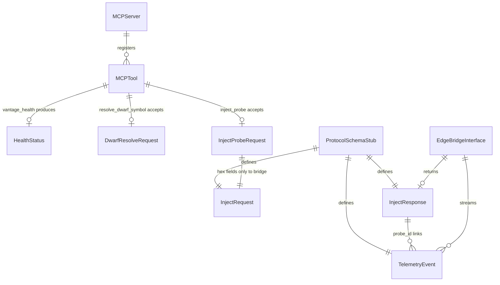

# Data Model: MCP Server Scaffolding

**Feature**: 01-mcp-scaffolding | **Date**: 2026-07-04

**Spec reference**: [spec.md](./spec.md) | **Contracts**: [contracts/](./contracts/)

## Overview

This feature is stateless at runtime. Entities below describe the data shapes exchanged via MCP tools and the edge bridge interface, plus the static protocol schema documents.

---

## MCPServer

Represents the running control-plane process (logical entity, not persisted).

| Field | Type | Description |
|-------|------|-------------|
| status | `ServerStatus` enum | `starting`, `ready`, `error` |
| tools_registered | `list[str]` | Names of registered MCP tools |
| connection_state | `ConnectionState` enum | `disconnected`, `connected` (stdio client) |
| version | `str` | Server package version |
| started_at | `datetime` | Process start time (for uptime calculation) |

**State transitions**:
- `starting` → `ready` on successful stdio handshake
- `starting` → `error` on fatal startup failure
- `connection_state`: `disconnected` ↔ `connected` as MCP client attaches/detaches

---

## MCPTool

Metadata for each exposed MCP tool.

| Field | Type | Description |
|-------|------|-------------|
| name | `str` | Unique tool identifier (snake_case) |
| description | `str` | Human-readable purpose |
| kind | `ToolKind` enum | `functional` or `placeholder` |
| input_schema | JSON Schema ref | Tool argument shape |
| output_schema | JSON Schema ref | Tool response shape |

**Registered tools**:

| name | kind | Module |
|------|------|--------|
| `vantage_health` | functional | `tools/health.py` |
| `resolve_dwarf_symbol` | placeholder | `tools/dwarf.py` |
| `inject_probe` | placeholder | `tools/inject.py` |

---

## HealthStatus

Output of `vantage_health` tool (functional).

| Field | Type | Required | Validation |
|-------|------|----------|------------|
| status | `str` | yes | Must be `"ok"` when server is healthy |
| version | `str` | yes | Semver string |
| uptime_seconds | `float` | yes | >= 0 |
| tools_registered | `list[str]` | yes | Non-empty in scaffold |

---

## DwarfResolveRequest

Input to `resolve_dwarf_symbol` placeholder.

| Field | Type | Required | Validation |
|-------|------|----------|------------|
| binary_path | `str` | yes | Non-empty path string |
| symbol_name | `str` | yes | Non-empty string |

**Security**: `symbol_name` is MCP-side input only. MUST NOT appear in any edge bridge payload (FR-009).

---

## DwarfResolveResponse

Output of `resolve_dwarf_symbol` placeholder.

| Field | Type | Required | Validation |
|-------|------|----------|------------|
| implemented | `bool` | yes | Always `false` in scaffold |
| message | `str` | yes | Describes planned future behavior |
| binary_path | `str` | yes | Echo of input |
| symbol_name | `str` | yes | Echo of input |

---

## InjectProbeRequest

Input to `inject_probe` placeholder.

| Field | Type | Required | Validation |
|-------|------|----------|------------|
| target_binary_path | `str` | yes | Non-empty path string |
| hex_offset | `str` | yes | Must match `^0x[0-9A-Fa-f]+$` |
| probe_type | `ProbeType` enum | yes | `uprobe` or `kprobe` |
| telemetry_format | `TelemetryFormat` enum | yes | `latency_histogram`, `counter`, or `raw` |

**Security**: Only `hex_offset` (not symbol names) is forwarded to edge bridge payloads.

---

## InjectProbeResponse

Output of `inject_probe` placeholder (uses mock bridge).

| Field | Type | Required | Validation |
|-------|------|----------|------------|
| implemented | `bool` | yes | Always `false` for tool layer |
| message | `str` | yes | Describes stub/mock behavior |
| bridge_status | `str` | yes | From mock `InjectResponse.status` |
| probe_id | `str` | yes | From mock `InjectResponse.probe_id` |
| telemetry_sample | `TelemetryEvent` | no | One sample event from mock |

---

## EdgeBridgeInterface

Abstract interface for MCP → Edge communication.

| Method / Property | Signature | Description |
|-------------------|-----------|-------------|
| connection_state | `BridgeConnectionState` | `mock`, `connected`, `disconnected`, `error` |
| send_inject_request | `(InjectRequest) -> InjectResponse` | Send probe injection command |
| on_telemetry | callback `(TelemetryEvent) -> None` | Optional handler for streamed events |

**Implementations**:
- `MockEdgeBridge` — in-process, default for scaffold
- `LiveEdgeBridge` — reserved stub for future feature (not implemented)

---

## InjectRequest (Bridge Payload)

Maps to `libs/protocol/inject_request.schema.json`.

| Field | Type | Required | Validation |
|-------|------|----------|------------|
| message_type | `str` | yes | Constant `"inject_request"` |
| payload.target_binary_path | `str` | yes | Non-empty |
| payload.hex_offset | `str` | yes | `^0x[0-9A-Fa-f]+$` |
| payload.probe_type | `str` | yes | `uprobe` or `kprobe` |
| payload.telemetry_format | `str` | yes | See InjectProbeRequest enum |

---

## InjectResponse (Bridge Payload)

Maps to `libs/protocol/inject_response.schema.json`.

| Field | Type | Required | Validation |
|-------|------|----------|------------|
| message_type | `str` | yes | Constant `"inject_response"` |
| payload.status | `str` | yes | `success` or `error` |
| payload.probe_id | `str` | yes | Non-empty on success |
| payload.error_message | `str \| null` | yes | Null on success |

---

## TelemetryEvent (Bridge Payload)

Maps to `libs/protocol/telemetry_event.schema.json`.

| Field | Type | Required | Validation |
|-------|------|----------|------------|
| message_type | `str` | yes | Constant `"telemetry_event"` |
| payload.probe_id | `str` | yes | Matches inject response |
| payload.timestamp_ns | `int` | yes | Positive integer |
| payload.raw_data | `object` | yes | Opaque telemetry key-value pairs |

---

## ProtocolSchemaStub

Static JSON Schema document in `libs/protocol/`. Not instantiated at runtime in this feature.

| Attribute | Value |
|-----------|-------|
| format | JSON Schema Draft 2020-12 |
| files | `inject_request`, `inject_response`, `telemetry_event` |
| runtime validation | Out of scope for scaffold |

---

## Enumerations

```text
ServerStatus:     starting | ready | error
ConnectionState:  disconnected | connected
ToolKind:         functional | placeholder
ProbeType:        uprobe | kprobe
TelemetryFormat:  latency_histogram | counter | raw
BridgeConnectionState: mock | connected | disconnected | error
```

---

## Validation Rules Summary

| Rule ID | Applies to | Rule |
|---------|------------|------|
| VR-001 | `hex_offset` | Must start with `0x` followed by hex digits |
| VR-002 | All tool inputs | Required fields must be non-empty |
| VR-003 | Placeholder tools | Valid input returns stub (not HTTP/MCP error) |
| VR-004 | Invalid tool input | Return field-level error identifying bad field(s) |
| VR-005 | Bridge payloads | MUST NOT contain symbol names or human-readable function identifiers |
| VR-006 | Mock bridge | Must emit both InjectResponse and at least one TelemetryEvent |

---

## Entity Relationships


