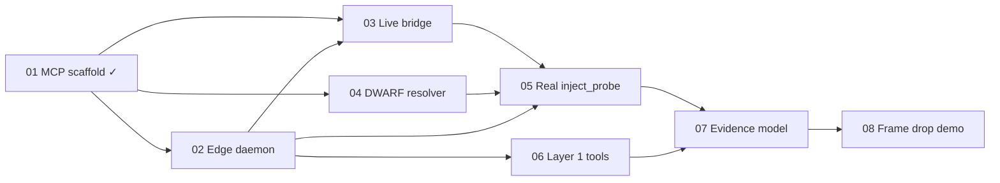

# Vantage Product Roadmap

**Version**: 1.0 | **Updated**: 2026-07-05

**North star (V1 demo):** On a Raspberry Pi or Jetson running a camera pipeline demo app, a developer asks in Cursor *"Why are frames dropping?"* Vantage returns process/CPU/memory context, injects one scheduler or block-IO probe, streams evidence, and the AI produces a ranked hypothesis with cited metrics — without the developer SSH'ing or writing eBPF.

**Principle:** Vantage provides runtime evidence; the AI agent performs root-cause analysis. Vantage does not replace the LLM's reasoning loop.

---

## Current state

| Feature | Status | Delivers |
|---------|--------|----------|
| [01-mcp-scaffolding](01-mcp-scaffolding/spec.md) | **Complete** | MCP stdio server, 3 tools (1 functional + 2 placeholders), mock edge bridge, protocol JSON schemas, strict mypy, integration tests |

**What works today:** Cursor can connect, invoke `vantage_health`, and receive structured stubs from `resolve_dwarf_symbol` / `inject_probe` (mock bridge only). No live device, no real telemetry, no investigations.

---

## Priority tiers

```text
Tier 1 — Core loop        02 → 03 → 04 → 05     (must ship before any real investigation)
Tier 2 — First evidence   06 → 07               (Layer 1 + LLM-ready context)
Tier 3 — V1 demo          08                    (one playbook, one device, one story)
Tier 4 — Expand V1        09 → 12               (Layer 2, more probes, hardening)
Tier 5 — V2/V3            (deferred)            (CI/HW-in-loop, RTOS, multi-device)
```

---

## Tier 1 — Core data plane (critical path)

These four features unlock the architecture in `.specify/memory/architecture.md`: laptop MCP ↔ WebSocket ↔ edge daemon ↔ eBPF.

### 02-edge-daemon

| | |
|---|---|
| **Directory** | `specs/02-edge-daemon/` (not yet created) |
| **Code** | `apps/edge-daemon/` (Rust, currently empty) |
| **Depends on** | 01-mcp-scaffolding (protocol schemas in `libs/protocol/`) |
| **Blocks** | 03, 05, 06, all telemetry |
| **Effort** | Large |

**Scope:** Rust edge daemon that runs on embedded Linux. WebSocket server accepting `inject_request` JSON. libbpf probe attach at hex offset (uprobe first). Ring-buffer telemetry streaming as `telemetry_event`. Read-only probe enforcement (reject memory-writing eBPF). Graceful probe detach.

**Independent test:** Start daemon on a Linux target (or VM), send `inject_request` via WebSocket client, receive `inject_response` + at least one `telemetry_event`.

**Out of scope:** DWARF parsing, symbol names, MCP server changes, multiple probe types beyond uprobe.

**Kickoff:**
```text
/speckit-specify Implement the Rust edge daemon in apps/edge-daemon: WebSocket server, libbpf uprobe injection at hex offsets, ring-buffer telemetry streaming (inject_request/inject_response/telemetry_event per libs/protocol). Read-only probes only. No DWARF, no symbol names.
```

---

### 03-live-bridge

| | |
|---|---|
| **Directory** | `specs/03-live-bridge/` |
| **Code** | `apps/mcp-server/src/vantage_mcp/bridge/` |
| **Depends on** | 01-mcp-scaffolding, 02-edge-daemon |
| **Blocks** | 05 (real end-to-end inject) |
| **Effort** | Medium |

**Scope:** Replace in-process `MockEdgeBridge` with `LiveEdgeBridge` using JSON-over-WebSockets. Read `VANTAGE_EDGE_WS_URL` to connect. Connection state management, reconnect/backoff basics, async telemetry callback. Mock remains available when URL unset (dev/CI).

**Independent test:** MCP server connects to running edge daemon; `inject_probe` (once real in 05) crosses the wire and receives live telemetry.

**Out of scope:** Device discovery, SSH tunneling, auth/mTLS (see 11).

**Kickoff:**
```text
/speckit-specify Implement LiveEdgeBridge in apps/mcp-server: JSON-over-WebSocket client to edge daemon using VANTAGE_EDGE_WS_URL, implementing the EdgeBridge interface. Keep MockEdgeBridge for dev when URL unset. Handle connection state and telemetry callbacks per libs/protocol schemas.
```

---

### 04-dwarf-resolver

| | |
|---|---|
| **Directory** | `specs/04-dwarf-resolver/` |
| **Code** | `apps/mcp-server/src/vantage_mcp/tools/dwarf.py` + new `dwarf/` module |
| **Depends on** | 01-mcp-scaffolding |
| **Blocks** | 05 (symbol → offset workflow) |
| **Effort** | Medium–Large |

**Scope:** Real DWARF parsing on the laptop (control plane). Input: `binary_path` + `symbol_name`. Output: hex offset + metadata. Support stripped ARM64/x86_64 ELF with debug info available locally. `resolve_dwarf_symbol` becomes functional. Symbol names never cross the bridge (FR-009).

**Independent test:** Point at a binary with DWARF debug info, resolve a known function name, get `0x…` offset matching `readelf`/`objdump`.

**Out of scope:** Remote binary fetch, edge-side parsing, inline debug info on target without local copy.

**Kickoff:**
```text
/speckit-specify Implement DWARF symbol resolution in apps/mcp-server: parse local ELF/DWARF debug info, compute hex memory offsets for resolve_dwarf_symbol. ARM64 and x86_64. Symbol names stay MCP-side only; output is hex offset suitable for inject_probe bridge payload.
```

---

### 05-real-inject-probe

| | |
|---|---|
| **Directory** | `specs/05-real-inject-probe/` |
| **Code** | `apps/mcp-server/src/vantage_mcp/tools/inject.py`, bridge, edge daemon integration |
| **Depends on** | 02, 03, 04 |
| **Blocks** | 07, 08 |
| **Effort** | Medium |

**Scope:** `inject_probe` becomes functional against live edge daemon. Accept hex offset (directly or via DWARF tool). Stream telemetry for configurable window. Probe lifecycle: inject → collect → detach. Tool response includes structured evidence summary, not just raw ring-buffer dumps.

**Independent test:** End-to-end: resolve symbol → inject at offset → receive live telemetry stream → probe removed.

**Out of scope:** Multiple simultaneous probes, kprobe, scheduler/block-IO probes (later features).

**Kickoff:**
```text
/speckit-specify Make inject_probe functional end-to-end: live edge bridge, real uprobe injection, telemetry streaming window, probe detach. Integrate with resolve_dwarf_symbol output. Structured tool response for AI consumption.
```

---

## Tier 2 — First investigation evidence

### 06-layer1-tools

| | |
|---|---|
| **Directory** | `specs/06-layer1-tools/` |
| **Code** | `apps/mcp-server/src/vantage_mcp/tools/discovery/` or edge daemon collectors |
| **Depends on** | 02-edge-daemon (preferred) or SSH fallback |
| **Blocks** | 07, 08 |
| **Effort** | Medium |

**Scope:** Layer 1 telemetry — no dynamic instrumentation. MCP tools:

| Tool | Source |
|------|--------|
| `get_processes` | `/proc` or edge daemon |
| `get_threads` | `/proc/{pid}/task` |
| `get_system_state` | CPU, memory, load, uptime |
| `get_journal_logs` | journald tail (filtered) |

**Independent test:** Invoke each tool against a live embedded target; receive structured JSON within 5 seconds.

**Out of scope:** perf, ftrace, eBPF (Layer 2/3).

**Kickoff:**
```text
/speckit-specify Add Layer 1 MCP discovery tools: get_processes, get_threads, get_system_state, get_journal_logs. Collect from embedded Linux target via edge daemon. Structured JSON output for AI agents.
```

---

### 07-evidence-model

| | |
|---|---|
| **Directory** | `specs/07-evidence-model/` |
| **Code** | `apps/mcp-server/src/vantage_mcp/evidence/` |
| **Depends on** | 05, 06 |
| **Blocks** | 08 |
| **Effort** | Medium |

**Scope:** Unified Evidence Model — normalize outputs from Layer 1 tools, inject_probe telemetry, and timestamps into a single structured context document the LLM can cite. Include: investigation_id, evidence_items[], source_tool, timestamp_ns, summary, raw_data. Optional MCP **resource** or composite tool `get_investigation_context`.

**Independent test:** Run get_system_state + inject_probe; aggregate into one evidence bundle with cross-references and human-readable summaries on MCP side.

**Out of scope:** Server-side RCA, confidence scoring, playbook orchestration.

**Kickoff:**
```text
/speckit-specify Implement Unified Evidence Model in apps/mcp-server: normalize Layer 1 and inject_probe outputs into structured investigation context for LLM consumption. Human-readable summaries on MCP side; hex/raw on wire only.
```

---

## Tier 3 — V1 demo (prove the thesis)

### 08-frame-drop-playbook

| | |
|---|---|
| **Directory** | `specs/08-frame-drop-playbook/` |
| **Code** | `playbooks/`, demo app, docs |
| **Depends on** | 05, 06, 07 |
| **Blocks** | Public demo, investor/customer conversations |
| **Effort** | Medium |

**Scope:** First end-to-end investigation story matching the white paper camera pipeline example.

1. **Demo app** — Simple camera pipeline simulator on Pi/Jetson that drops frames when a background thread does synchronous eMMC writes.
2. **Playbook** — Documented investigation sequence (MCP prompts + tool order): CPU/memory → scheduler probe → block I/O probe → evidence aggregation.
3. **Cursor integration guide** — Step-by-step reproducing the white paper workflow.

**Independent test:** Developer follows guide; AI completes investigation and identifies storage writes as root cause with cited evidence.

**Out of scope:** Automated playbook engine in server; multiple playbooks; CI integration.

**Kickoff:**
```text
/speckit-specify Frame drop investigation demo: camera pipeline test app on embedded Linux, documented playbook (Layer 1 → scheduler eBPF → block IO eBPF), Cursor walkthrough matching white paper example. Uses existing MCP tools and evidence model.
```

---

## Tier 4 — Expand V1 (post-demo)

| ID | Feature | Summary | Depends on |
|----|---------|---------|------------|
| 09 | **layer2-diagnostics** | perf snapshots, ftrace, `/sys` IO stats — `capture_perf_snapshot`, `get_scheduler_statistics`, `get_io_statistics` | 02, 06 |
| 10 | **ebpf-probe-library** | Scheduler (`sched_switch`), block I/O, IRQ trace probes; probe templates | 05 |
| 11 | **device-connectivity** | SSH tunnel helper, target registration, mTLS for production WebSocket | 03 |
| 12 | **production-hardening** | MCP auth, edge daemon auth, audit log, rate limits | 03, 11 |

---

## Tier 5 — V2/V3 (deferred)

| Horizon | Themes | Notes |
|---------|--------|-------|
| **V2** | CI/CD integration, HW-in-the-loop, PR-level RCA, regression discovery | Requires stable V1 demo + device farm |
| **V3** | RTOS support, Linux↔RTOS correlation, multi-device timelines | Major architecture extension |

Do not spec these until Tier 3 demo is validated with real users.

---

## Dependency graph



**Parallel tracks after 01:**

- **Track A (edge):** 02 → 03 → 05
- **Track B (symbols):** 04 → 05
- **Track C (context):** 02 → 06 → 07 → 08

Tracks A + B merge at 05. Track C merges at 07–08.

---

## Recommended execution order

| Order | Feature | Rationale |
|-------|---------|-----------|
| 1 | **02-edge-daemon** | Without data plane, nothing is real |
| 2 | **03-live-bridge** | Connects scaffold to edge |
| 3 | **04-dwarf-resolver** | Can proceed in parallel with 02–03 |
| 4 | **05-real-inject-probe** | First end-to-end proof |
| 5 | **06-layer1-tools** | Broadens evidence without new eBPF |
| 6 | **07-evidence-model** | Makes multi-tool output LLM-useful |
| 7 | **08-frame-drop-playbook** | Shippable V1 story |

---

## Speckit workflow per feature

For each feature above:

```text
1. /speckit-specify   ← use Kickoff text from this roadmap
2. /speckit-clarify
3. /speckit-plan
4. /speckit-checklist
5. /speckit-tasks
6. /speckit-analyze
7. /speckit-implement
```

Update `.specify/feature.json` when starting a new feature (the `create-new-feature.sh` script does this automatically).

---

## White paper → feature mapping

| White paper section | Feature(s) |
|---------------------|------------|
| Vantage MCP Server (transport) | 01 ✓ |
| Embedded Linux Device / edge daemon | 02 |
| Layer 1: Existing System Context | 06 |
| Layer 2: Native Linux Diagnostics | 09 |
| Layer 3: Dynamic eBPF Instrumentation | 02, 05, 10 |
| Discovery / Measurement tools | 06, 09, 10 |
| Investigation Playbooks | 08 (+ future playbook engine) |
| Unified Evidence Model | 07 |
| Camera pipeline example | 08 |
| Core principle: AI does RCA | 07 (evidence only, no RCA engine) |

---

## What NOT to build in early tiers

Avoid scope creep that delays the V1 demo:

- Investigation orchestrator in the MCP server (let Cursor/Claude orchestrate initially)
- RCA engine or confidence scoring in Vantage
- 25+ MCP tools before the frame-drop demo works
- Dashboard or web UI
- Multi-tenant hosting
- kprobe / full probe library before uprobe works end-to-end

---

## Next action

Start **02-edge-daemon**:

```text
/speckit-specify Implement the Rust edge daemon in apps/edge-daemon: WebSocket server, libbpf uprobe injection at hex offsets, ring-buffer telemetry streaming (inject_request/inject_response/telemetry_event per libs/protocol). Read-only probes only. No DWARF, no symbol names.
```
